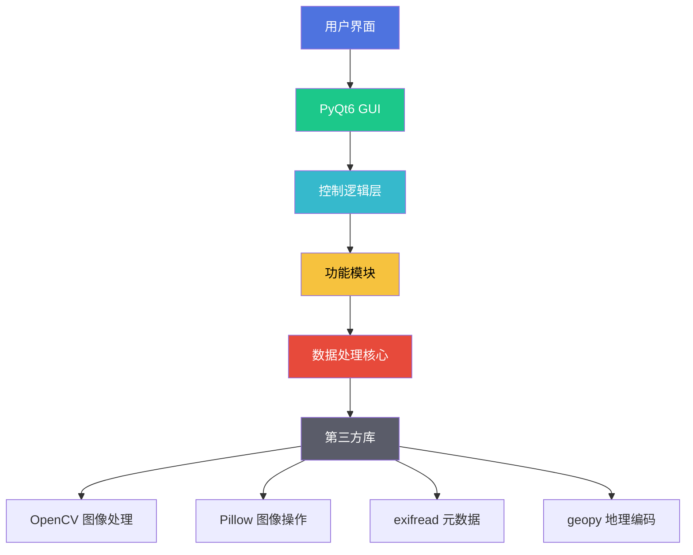
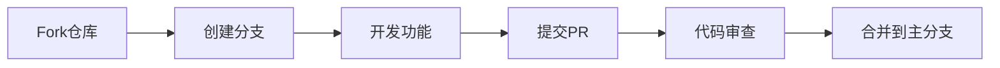

# 🍁 LeafView（枫叶相册）V1.2 免费公测版  

[](https://github.com/YangShengzhou03/LeafView) [](LICENSE) [](https://www.python.org/) [](https://github.com/YangShengzhou03/LeafView/releases)

> **智能媒体整理专家 | 照片视频高效管理 | 隐私安全无忧 | 免费开源**  

LeafView 是一款基于 Python + PyQt6 开发的智能媒体管理工具，通过深度学习技术和多线程处理，帮助用户高效整理照片和视频文件。所有操作均在本地完成，确保您的隐私安全。  

---

## 📚 目录
- [🌟 核心功能](#核心功能)
- [🏗️ 技术架构](#技术架构)
- [📁 文件结构](#文件结构)
- [⚙️ 安装指南](#安装指南)
- [🚀 使用教程](#使用教程)
- [🔒 安全隐私](#安全隐私)
- [🤝 参与贡献](#参与贡献)
- [❓ 常见问题](#常见问题)
- [📞 联系我们](#联系我们)
- [📜 开源许可](#开源许可)

---

## 🌟 核心功能

### 🖼️ 智能图像分类
| 功能 | 说明 | 支持格式 |
|------|------|----------|
| 自动识别 | 识别风景、人物、宠物等 | JPG/JPEG/PNG/BMP/WEBP |
| 分类存储 | 自动归类到对应文件夹 | - |
| 深度学习 | 使用ResNet模型进行识别 | - |

```python
# 示例：启动图像分类
LeafView.exe --classify /path/to/photos
```

### 🗂️ 智能整理系统
- **多级文件夹结构**：`{年}/{月}_{地点}`
- **文件操作选项**：移动/复制/创建硬链接
- **自动清理**：移除空文件夹

```bash
# 按时间地点整理
LeafView.exe --organize /path/to/images --structure "{year}/{month}_{location}"
```

### 🔤 智能重命名
支持变量模板：
- `{year}` `{month}` `{day}` - 拍摄日期
- `{hour}` `{minute}` `{second}` - 拍摄时间
- `{location}` - 拍摄地点
- `{camera}` - 相机型号

```bash
# 批量重命名示例
LeafView.exe --rename /path/to/images --template "Vacation_{year}-{month}-{day}_{location}"
```

### 🔍 文件去重
| 相似度阈值 | 说明 | 适用场景 |
|------------|------|----------|
| 0 (完全一致) | 100%相同文件 | 精确去重 |
| 8 (高度相似) | 轻微差异 | 相似照片 |
| 24 (部分相似) | 明显差异但有共同点 | 系列照片 |
| 32 (明显不同) | 完全不同 | 不推荐使用 |

```bash
# 去重命令示例
LeafView.exe --deduplicate /path/to/images --threshold 8
```

### 📝 EXIF元数据编辑
支持编辑：
- 拍摄日期时间
- GPS地理位置
- 相机型号参数
- 版权信息
- 作者信息
- 星级评分

```bash
# 修改EXIF数据
LeafView.exe --write-exif /path/to/images --time "2023-10-01 10:00:00" --location "Paris, France"
```

---

## 🏗️ 技术架构



---

## 📁 文件结构

```
LeafView/
├── App.py                        # 主程序入口
├── MainWindow.py                 # 主窗口逻辑
├── resources/                    # 图标资源
├── modules/                      # 功能模块
│   ├── Classification.py         # 图像分类
│   ├── Contrast.py               # 文件去重
│   ├── WriteExif.py              # EXIF编辑
│   └── Read.py                   # 文件读取
├── threads/                      # 多线程处理
│   ├── ClassificationThread.py   # 分类线程
│   ├── ContrastThread.py         # 去重线程
│   └── WriteExifThread.py        # EXIF线程
└── UI/                           # 界面文件
    ├── MainWindow.ui             # 主界面设计
    └── UpdateDialog.ui           # 更新对话框
```

---

## ⚙️ 安装指南

### Windows用户
1. [下载安装包](https://github.com/YangShengzhou03/LeafView/releases)
2. 运行`LeafView_Setup.exe`
3. 按照向导完成安装

### 开发者安装
```bash
# 克隆仓库
git clone https://github.com/YangShengzhou03/LeafView.git

# 安装依赖
pip install -r requirements.txt

# 运行应用
python App.py
```

### 打包应用
```bash
# 创建可执行文件
pyinstaller --onefile --windowed --icon=resources/icon.ico App.py
```

---

## 🚀 使用教程

### 四步快速入门
1. **选择文件夹**：点击"导入文件夹"按钮
2. **设置选项**：
   - ☑️ 包含子文件夹
   - ☑️ 保留原始文件（推荐）
3. **选择功能**：
   - 图像分类
   - 智能整理
   - 文件去重
   - EXIF编辑
4. **开始处理**：点击"开始"按钮查看实时进度

### 视频教程
[](https://www.bilibili.com/video/BV1qgfmYmEAa)

---

## 🔒 安全隐私

### 隐私保护措施
- 🔐 所有数据处理均在本地完成
- 🌐 网络访问仅用于逆地理编码（可禁用）
- 🗑️ 删除操作会移至回收站
- ⚠️ 重要操作前自动提示备份

### 安全建议
1. 处理敏感照片前创建备份
2. 禁用网络连接避免位置查询
3. 定期更新到最新版本

---

## 🤝 参与贡献

### 贡献流程


### 急需贡献
- 🌍 多语言翻译（中/英/日/韩）
- 🧪 单元测试覆盖
- 📱 移动端适配
- 🖼️ RAW格式支持

### 代码规范
```python
def example_function(param: int) -> str:
    """
    符合PEP8规范的函数示例
    
    :param param: 整数参数
    :return: 字符串结果
    """
    if param < 0:
        raise ValueError("正数参数要求")
    return f"Result: {param * 2}"
```

---

## ❓ 常见问题

### 图像处理问题
**Q1：为什么有些图片无法识别地理位置？**  
A：免费API每日限5000次请求，建议：  
1. 分批处理图片  
2. 使用本地GPS数据  
3. [购买高级密钥](https://leafview.pro/premium)

**Q2：如何提高图像识别准确率？**  
A：确保：  
- 图片清晰度高  
- 主要物体占据画面中心  
- 避免过度曝光或模糊  

### 功能使用问题
**Q3：可以取消正在进行的操作吗？**  
A：当前版本无法中断处理，建议：  
1. 处理前测试小批量样本  
2. 使用更强大的硬件  
3. V1.3将添加任务取消功能

**Q4：是否支持RAW格式？**  
A：当前版本不支持，但：  
- CR2/NEF支持已在开发路线图  
- 欢迎提交PR添加此功能

### 技术问题
**Q5：运行时提示缺少DLL文件**  
解决方案：  
1. 安装[Visual C++ Redistributable](https://aka.ms/vs/16/release/vc_redist.x64.exe)  
2. 运行`pip install --upgrade pyqt6`  
3. 重新安装LeafView

**Q6：地理编码服务返回错误**  
可能原因：  
1. 网络连接问题  
2. API限额用完  
3. 无效坐标数据  
   
解决方法：  
```python
# 在config.ini中禁用地理编码
[geocoding]
enable = false
```

---

## 📞 联系我们

| 联系方式 | 详情 |
|----------|------|
| GitHub | [YangShengzhou03/LeafView](https://github.com/YangShengzhou03/LeafView) |
| 邮箱 | yangsz03@foxmail.com |
| 社区 | [LeafView讨论区](https://github.com/YangShengzhou03/LeafView/discussions) |
| 博客 | [CSDN技术博客](https://blog.csdn.net/Yang_shengzhou) |

问题反馈模板：  
```markdown
**问题描述**  
清晰描述遇到的问题  

**重现步骤**  
1. 打开应用
2. 点击...
3. 观察到...

**预期结果**  
期望发生的正确行为  

**环境信息**  
- 系统：Windows 11
- 版本：LeafView V1.2
- 硬件：16GB RAM
```

---

## 📜 开源许可

LeafView 采用 [MIT 许可证](LICENSE) 开源：
- ✅ 允许自由使用、修改和分发  
- ✅ 允许商业用途  
- ✅ 无担保责任  
- ⚠️ 需保留版权信息  

```text
Copyright (c) 2023 Yangshengzhou

特此免费授予任何获得本软件及相关文档（以下简称"软件"）副本的人，
不受限制地处理本软件，包括但不限于使用、复制、修改、合并、发布、
分发、再许可的权利。
```

---

> **枫叶虽小，自成风景**  
> LeafView 愿成为您数字记忆的守护者，  
> 让每一张照片都找到归属，  
> 每一次回忆都清晰如初。  


## 📞 联系与支持  
- **项目主页**：[https://gitee.com/Yangshengzhou/leaf-view](https://gitee.com/Yangshengzhou/leaf-view)
- **文档中心**：[https://yangshengzhou.gitbook.io/leaf-view](https://yangshengzhou.gitbook.io/leaf-view)
- **问题反馈**：[提交Issue](https://gitee.com/Yangshengzhou/leaf-view/issues)
- **商务合作**：3555844679@qq.com（主题注明"LeafView合作"）  
- **社区交流**：  
    
    

🌟 **Star 项目支持我们** → [https://github.com/YangShengzhou03/LeafView](https://github.com/YangShengzhou03/LeafView)